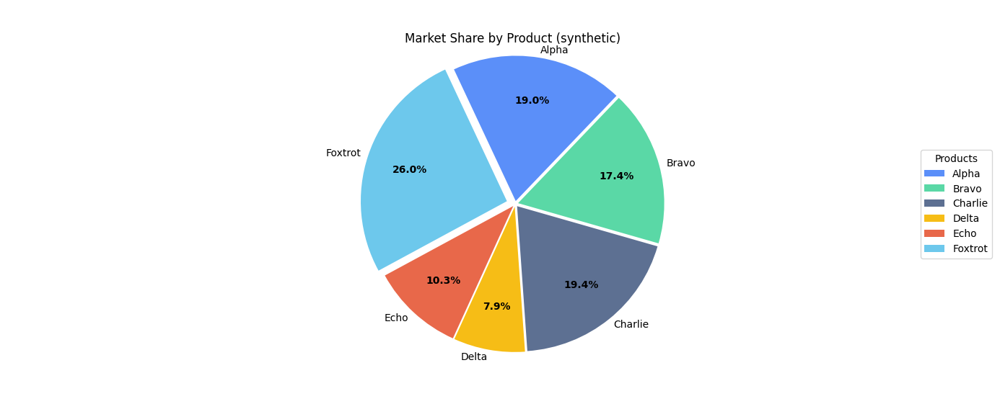

# Pie Chart Showcase

An original, GitHub‑ready mini‑project demonstrating a clean, publication‑quality **pie chart** with:

- Custom color palette and tasteful explode
- Percentage labels (normalized) and legend
- Synthetic dataset (no course scaffolding)
- Optional PNG export for your README

## Run it

```bash
python pie_chart_showcase.py
```

## Save a preview image for GitHub

```bash
python -c "import pie_chart_showcase as p; p.main(save_png=True)"
```

Output: 




## Requirements

- Python 3.8+
- `matplotlib`, `numpy`

Optional `requirements.txt`:

```
matplotlib
numpy
```

## Why this is safe to publish

- Uses self‑generated, fictional data
- Different styling and structure from course assignments
- Standalone script with clear README and license suggestion

## Files

- `pie_chart_showcase.py` — main script
- `README_pie_chart_showcase.md` — this file

## License

MIT

